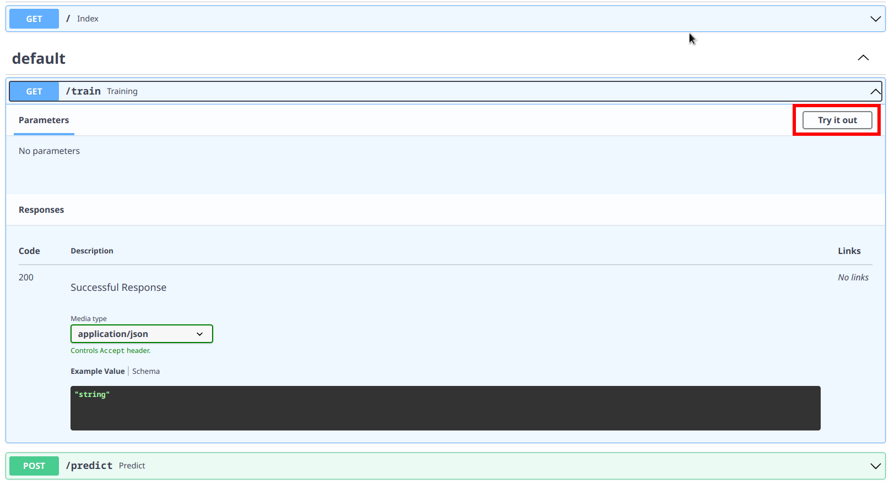
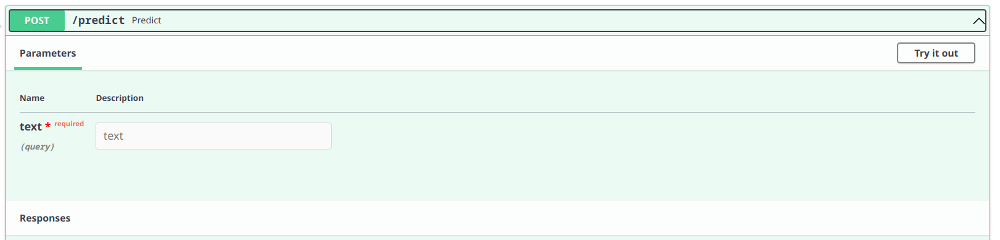

# Summarize4Me

## Table of Contents
* <a href="https://github.com/akshathmangudi/Summarize4Me#overview">Overview</a>
* <a href="https://github.com/akshathmangudi/Summarize4Me#requirements">Requirements</a> 
  * <a href="https://github.com/akshathmangudi/Summarize4Me#prerequisites">Prerequisites</a>
  * <a href="https://github.com/akshathmangudi/Summarize4Me#creating-virtualvenv">Creating virtualenv</a>
  * <a href="https://github.com/akshathmangudi/Summarize4Me#installing-dependencies">Installing dependencies</a>
* <a href="https://github.com/akshathmangudi/Summarize4Me#running-the-program">Running the program</a>
* <a href="https://github.com/akshathmangudi/Summarize4Me#next-steps">Next Steps</a>
* <a href="https://github.com/akshathmangudi/Summarize4Me#license">License</a>

## Overview
Extractive Summarization is a Natural Language Processing (NLP) technique which aims to summarize given text based on 
text input. Unlike abstractive summarization, which generates new sentences based on the input, extractive summarization
generates a summary from the sentences present from the original document to generate a summary. 

Extractive Summarization involves four main steps: 
1. Text preprocessing
2. Tokenization
3. Sentence selection
4. Summary generation

All these steps will be explained in detail in this repository. 

## Requirements
### Prerequisites
Before running the program, the prerequisites and the virtual environment must be present. 
Virtual environments, in other words, are worlds of their own. Their environment does NOT affect the 
global environment of the system. Dependencies can be installed without interfering with the global version of 
the same dependencies. This allows for downgrading to be hassle-free.

Change into your desired directory and pass the following commands into your terminal: 
```shell
git clone https://github.com/akshathmangudi/Summarize4Me.git
cd Summarize4Me/
```
### Creating virtualvenv
For Python 3.6+ users: 
```shell
python -m venv /path/to/virtualenv
```
For activation of virtualenv:
bash/zsh: 
```bash 
$ source <venv>/bin/activate
```
fish: 
```shell
$ source <venv/bin/activate.fish
```
cmd.exe: 
```shell
C:\> <venv>\Scripts\activate.bat
```
```shell
PowerShell: 
PS C:\> <venv>\Scripts\activate.ps1
```
For conda users, the following commands are to be sequentially passed into your terminal: 

```bash
conda -V
conda update conda
conda create -n <envname> python=x.x anaconda
conda activate <envname>
```
For deactivation: 
```bash
conda deactivate
```
### Installing dependencies
There's two ways to install the dependencies required for this program. Either each dependency can be 
installed manually (list is in requirements.txt) or a much shorter method is preferred: 
```bash
pip install -r requirements.txt
```
## Running the program
Running the program is very simple, after installation of the dependencies and creating the virtual environment, 
you're ready to run the application. In your terminal, simple type: 
```bash
python app.py
``` 
and you'll be redirected to a localhost:8080 page with two GET blocks and one POST block.


The picture highlights a red box with the text "Try it out". This allows for the program to create the necessary 
files and folders to be created for prediction. This does not require any parameters.
## Future action

"text" can be inputted ino the textbox and a summary will be generated based on the model training. A maximum of 
2048 characters of text can be inputted and a summary upto 240 words will be generated. 

## Next Steps
Future goals of this application is to deploy this using AWS. Thank you for checking out this project, and if 
you encounter any problems, please email me: akshathmangudi@gmail.com

## License
This repository is licensed under the MIT License. See the LICENSE file for details.
